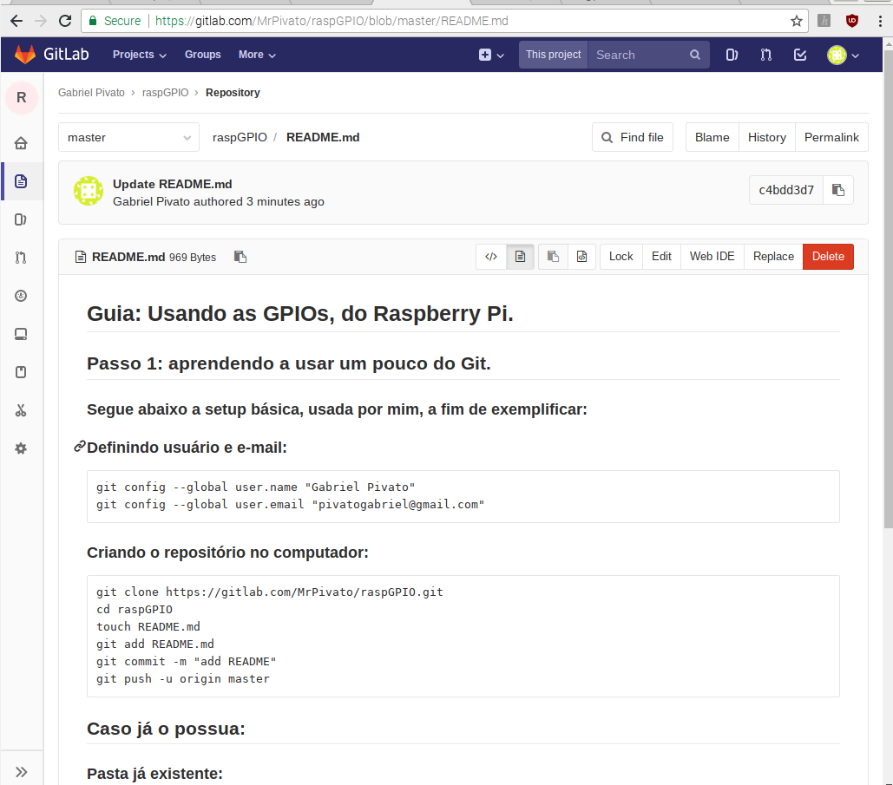
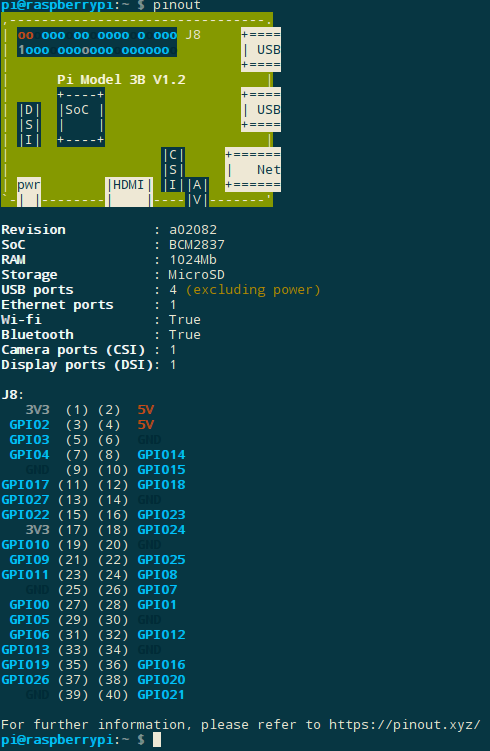
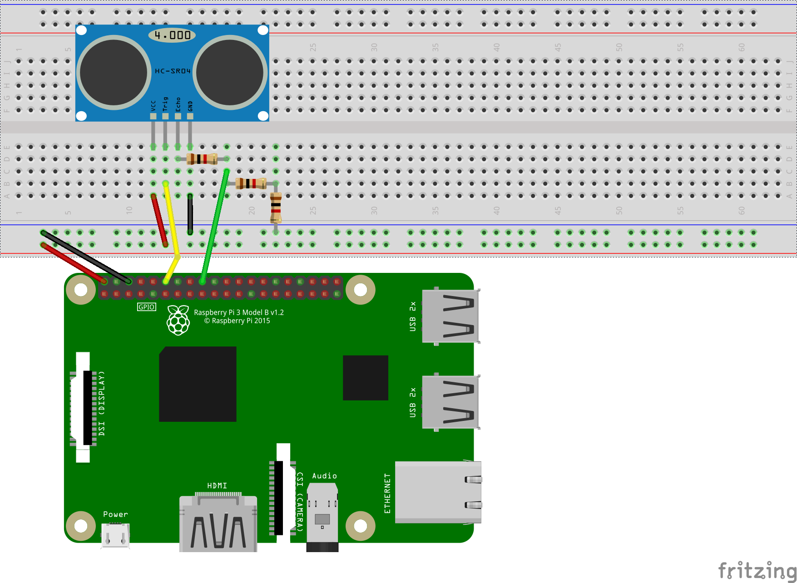

# Guia: Usando as GPIOs, do Raspberry Pi.

## Passo 1: aprendendo a usar um pouco do Git.

### Segue abaixo a setup básica, usada por mim, a fim de exemplificar:

### Definindo usuário e e-mail:
    git config --global user.name "Gabriel Pivato"
    git config --global user.email "pivatogabriel@gmail.com"

### Criando o repositório no computador:
    git clone https://gitlab.com/MrPivato/raspGPIO.git
    cd raspGPIO
    touch README.md
    git add README.md
    git commit -m "add README"
    git push -u origin master

## Caso já o possua:

### Pasta já existente:
    cd existing_folder
    git init
    git remote add origin https://gitlab.com/MrPivato/raspGPIO.git
    git add .
    git commit -m "Initial commit"
    git push -u origin master

### Repo já existente:
    cd existing_repo
    git remote rename origin old-origin
    git remote add origin https://gitlab.com/MrPivato/raspGPIO.git
    git push -u origin --all
    git push -u origin --tags

### Resultado:

### No momento, apenas execute:
    git clone https://gitlab.com/MrPivato/raspGPIO.git
    
## Passo 2: instalando o software necessário.

### 1° De permissão para que os scripts sejam executáveis:
    cd raspGPIO/shell_scripts
    chmod +x *.sh

### 2° Execute o script de update que foi disponibilizado:
    ./update.sh
    
Link do arquivo: [update.sh](shell_scripts/update.sh "Link update.sh")

### 3° Execute o script para instalar os programas necessários, que foi disponibilizado:
    ./software.sh
    
Link do arquivo: [software.sh](shell_scripts/software.sh "Link software.sh")

## Passo 3: mão na massa.

### 1° Entendendo a GPIO.
#### Execute o seguinte comando em seu terminal:
    pinout

### Ele deve retornar algo parecido com isto:

Agora você sabe como estão dispostos os pinos! 

### 2° Criando um circuito básico.
#### Construa o seguinte esquema:

### Logo após, execute o arquivo python:
    cd ../python_code
    python hcsr04.py
    
