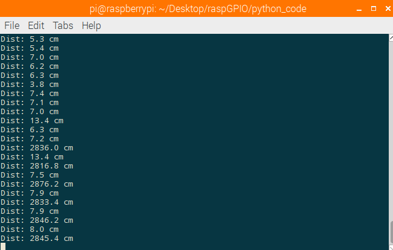

# Guia: Usando as GPIOs do Raspberry Pi.

## Passo 1: Git.

### No momento, apenas execute:
    git clone https://gitlab.com/MrPivato/raspGPIO.git
    
## Passo 2: instalando o software necessário.

### 1° De permissão para que os scripts sejam executáveis:
    cd raspGPIO/shell_scripts
    chmod +x *.sh

### 2° Execute o script de update que foi disponibilizado:
    ./update.sh
    
Link do arquivo: [update.sh](shell_scripts/update.sh "Link update.sh")

### 3° Execute o script para instalar os programas necessários, que foi disponibilizado:
    ./software.sh
    
Link do arquivo: [software.sh](shell_scripts/software.sh "Link software.sh")

## Passo 3: mão na massa.

### 1° Entendendo a GPIO.
#### Execute o seguinte comando em seu terminal:
    pinout

### Ele deve retornar algo parecido com isto:

Agora você sabe como estão dispostos os pinos! 

### 2° Criando um circuito básico.
#### Construa o seguinte esquema:

### Logo após, execute o arquivo python:
    cd ../python_code
    python hcsr04.py
    
### Agora você pode medir a distância com o seu sensor!

### E se o código fosse feito no Arduino?

<strong>As ligações físicas continuariam basicamente as mesmas, porém, não teríamos a flexibilidade de poder usar a linguagem de programação que bem quisermos.</strong>

<strong>Segue a comparação a seguir:</strong>
Arquivo em python [hcsr04.py](python_code/hcsr04.py "Link para o arquivo python")
    : VS : 
Arquivo em wiring [hcsr04.ino](arduino_code/hcsr04.ino "Link para o arquivo em wiring")

## Passo 4: escolha suas ferramentas e seja livre!
### Mais linguagens de programação que podem ser usadas para programar as GPIOs:
+ C;
+ Node.js;
+ Python;
+ Rust;
+ Go;
+ E muito mais;
